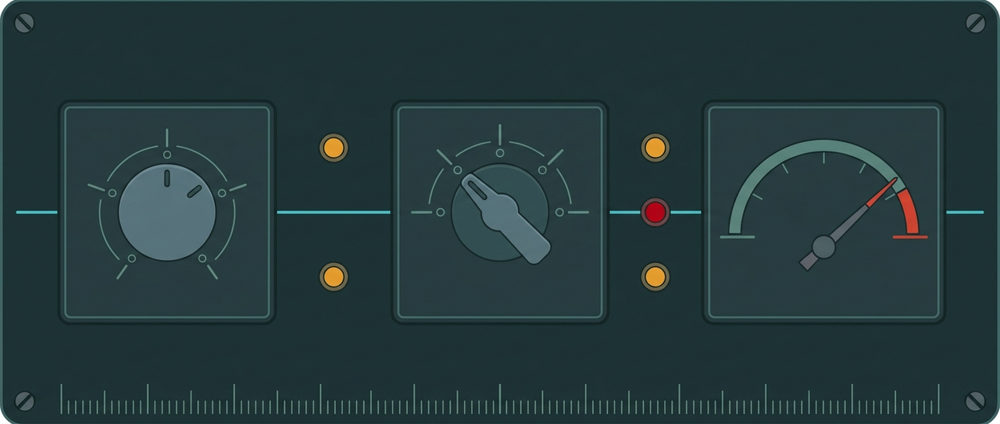
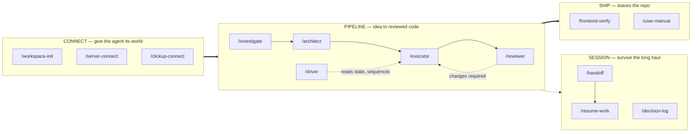
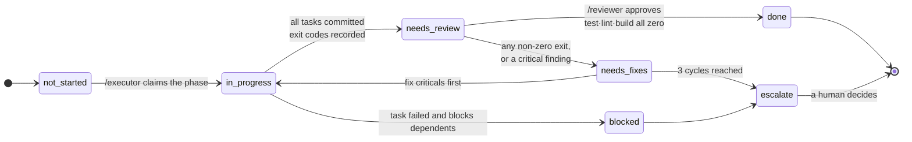
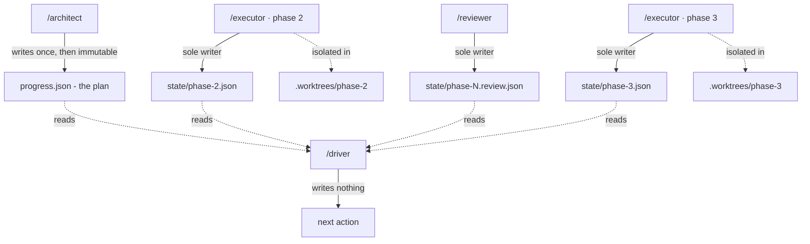

<div align="center">



<h1>claude-code-engineer</h1>

<p><strong>What it takes to run Claude Code as a teammate that owns work end to end —<br>
kept current with how the models actually behave.</strong></p>

<p>
  <a href="#install">Install</a> ·
  <a href="CLAUDE.md">Instruction file</a> ·
  <a href="skills/">Skills</a> ·
  <a href="docs/example-run.md">A real run</a> ·
  <a href="CHANGELOG.md">Changelog</a>
</p>

<sub>MIT · 13 skills · 32 regression assertions · every behavioural claim dated and sourced</sub>

</div>

---

Most agent setups get written once and never touched again. That was fine when model
behaviour was stable. It isn't any more — four frontier models shipped in under two months
in 2026, and some of the advice that made agents better in January makes them worse now.

Everything here carries a dated changelog, so you can see what changed and decide whether
you agree.

<table>
<tr>
<td width="50%" valign="top">

### `CLAUDE.md`

The four principles that became the community standard, plus the amendments current models
actually need.

Works as `AGENTS.md` for Codex, Cursor and Gemini CLI — content identical.

</td>
<td width="50%" valign="top">

### `skills/`

Thirteen skills that connect Claude Code to your world, take work from idea to reviewed
code, verify it in a browser, and survive a long session.

Installable as a plugin, or copied in by hand.

</td>
</tr>
</table>

---

## Install

**The instruction file:**

```bash
curl -Lo CLAUDE.md https://raw.githubusercontent.com/makieali/claude-code-engineer/main/CLAUDE.md
```

**The skills, as a plugin:**

```
/plugin marketplace add makieali/claude-code-engineer
/plugin install claude-code-engineer@claude-code-engineer
```

<details>
<summary><strong>Or copy them in by hand</strong></summary>

<br>

```bash
git clone https://github.com/makieali/claude-code-engineer
cp -R claude-code-engineer/skills/* ~/.claude/skills/
rm -f ~/.claude/skills/README.md    # the skills index, not a skill
```

Per-project instead of user-wide: copy into `.claude/skills/` in the project root.

</details>

**This is a menu, not a monolith.** Delete what doesn't apply and add your real commands,
file paths and test gates. Instructions that don't earn their place make the ones that do
harder to follow.

---

## The map



<table>
<tr><td valign="top" width="22%"><strong>Connect</strong></td>
<td>These <strong>discover, then write their own notes</strong> — they are not templates you
fill in. Which is also why none of your infrastructure is in this repo: the procedure is
public, your hosts and tokens are generated locally into gitignored folders.</td></tr>

<tr><td valign="top"><strong>Pipeline</strong></td>
<td>Nothing in it verifies itself. The executor proves each task with a command that can
fail; the reviewer runs in a <strong>fresh context</strong> — spawned as a subagent, so it is
empty by construction — and its verdict is gated on real exit codes, not a checklist.</td></tr>

<tr><td valign="top"><strong>Ship</strong></td>
<td><code>/frontend-verify</code> captures at three viewports, reads the console, checks the
accessibility tree, fixes, re-captures. <code>/user-manual</code> reads the codebase, drives
the real UI, and writes prose <em>against the screenshots it got</em> — never before.</td></tr>

<tr><td valign="top"><strong>Session</strong></td>
<td><code>/handoff</code> writes the record while your judgment is intact, not when
auto-compact fires and the summarising model is already impaired.
<code>/decision-log</code> makes "ruled out" permanent.</td></tr>
</table>

> **Worth knowing:** no skill can run `/clear` or `/compact` for you. Those are REPL commands
> with no tool behind them. The loop is write → **you** reset → read. Anything claiming
> otherwise is guessing.

---

## How a phase actually closes

A phase is not done because a model says so. It is done when an external gate says so, and
the loop has a hard stop so a bad plan cannot spin forever.



**A non-zero exit on test, lint or build forces `changes_required`** — regardless of how good
the code looks. Three failed review cycles means the plan is wrong, not the implementation.

---

## Why parallel phases don't corrupt each other

The distinctive design decision, and the one that took measuring to get right.



**No file ever has two writers, so no lock is needed**, and each parallel phase works in its
own git worktree so two executors cannot fight over the index.

`/driver` reads all of it and writes none of it. What that means in practice: you can run
phases 2 and 3 at the same time in separate terminals and their state cannot corrupt each
other.

---

## Does it actually work?

[**`docs/example-run.md`**](docs/example-run.md) is the whole pipeline applied to a real
open-source repo — plan, three phases (two concurrent in git worktrees), review, merge —
with the **five defects it exposed left in** rather than tidied away.

`tests/run.sh` guards every one. **32 assertions, 7 cases**, each tied to a bug found by
*running* these skills, not reading them.

<table>
<tr><td width="34%"><strong>Mutation tested</strong></td>
<td>Reintroduce an original bug and the matching case fails. A green suite that cannot fail
is decoration.</td></tr>
<tr><td><strong>Staleness enforced</strong></td>
<td>A case fails when a model routing table ages past 90 days. A repo named <em>maintained</em>
should break its own build rather than quietly rot.</td></tr>
<tr><td><strong>Leaves no trace</strong></td>
<td>A case asserts the suite does not dirty the tree it tests — it found real pollution on its
first run.</td></tr>
</table>

---

## Attribution

Sections 1–4 of `CLAUDE.md` are from
[Forrest Chang's `andrej-karpathy-skills`](https://github.com/forrestchang/andrej-karpathy-skills),
derived from Andrej Karpathy's January 2026 observations on LLM coding failure modes.

**Karpathy wrote the diagnosis, not the file, and has not endorsed either it or this fork.**
Worth stating plainly, because the original is widely misattributed to him directly.

Sections 5–8 and the skills are mine. Every behavioural claim comes from Anthropic's public
documentation, cited in [`CHANGELOG.md`](CHANGELOG.md) with the date it was verified. Claims
that are engineering rather than model behaviour are labelled as such, without a borrowed
citation.

## Maintenance

The changelog isn't housekeeping — it's the argument. If instruction files are code, they
need version history, and *"when did this stop being true"* needs an answer.

Reviewed on every frontier model release. Spot something that's aged? Open an issue —
corrections with a documentation link get merged fast.

## Licence

[MIT](LICENSE).

---

<div align="center">
<sub>Claude, Claude Code, and Anthropic are trademarks of Anthropic, PBC, used here for
identification only.<br>This is an independent project, not affiliated with or endorsed by
Anthropic.</sub>
</div>
